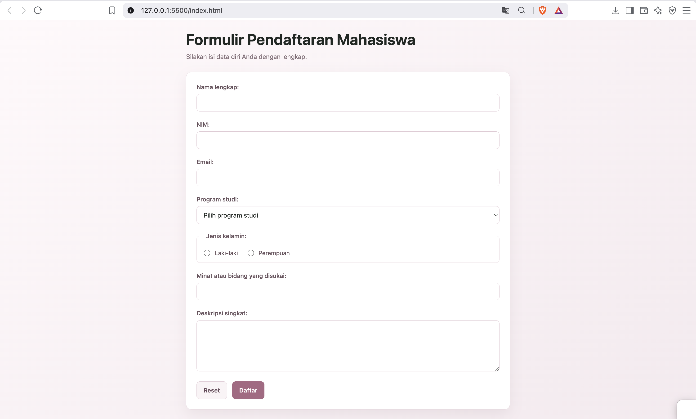

# Formulir Pendaftaran Mahasiswa

## Deskripsi
Website ini terdiri dari dua halaman, yaitu:

1. **Halaman Pendaftaran** (`index.html`) untuk mengisi data mahasiswa.
2. **Halaman Detail** (`detail.html`) untuk menampilkan data pendaftar dalam bentuk tabel dummy.

Form pada halaman pendaftaran menggunakan method `GET` untuk mengirim data menuju halaman detail melalui **query string** pada URL.
Halaman detail hanya menampilkan data dummy dan tidak menangkap atau mengolah data yang dikirim melalui query string.

## Fitur

### 1. Halaman Pendaftaran

Halaman `index.html` menyediakan formulir yang terdiri dari:

- Nama lengkap
- NIM
- Email
- Program studi
- Jenis kelamin
- Minat atau bidang yang disukai
- Deskripsi singkat
- Tombol Reset
- Tombol Daftar

Form menggunakan method `GET` dengan tujuan halaman `detail.html`.

```html
<form action="detail.html" method="get">
```

### 2. Halaman Detail

Halaman `detail.html` menampilkan informasi mahasiswa dalam bentuk tabel.
Data yang ditampilkan merupakan **data dummy**, sehingga tidak berubah berdasarkan data yang diisi pada halaman pendaftaran.

## GET dan Query String

Method `GET` digunakan untuk mengirim data form melalui URL.
Ketika pengguna mengisi form dan menekan tombol **Daftar**, browser akan berpindah ke halaman `detail.html` dan data form akan ditambahkan ke URL sebagai **query string**.

Contoh:

```text
detail.html?nama=lala+lulu&nim=124140000&email=lalaluu%40gmail.com&program_studi=informatika
```

Bagian setelah tanda `?` merupakan query string yang berisi parameter dan nilai dari form.
Contohnya:

```text
nama=lala+lulu
nim=124140000
email=lalaluu%40gmail.com
program_studi=informatika
```

Pada tugas ini, query string hanya digunakan untuk **melempar data dari halaman pendaftaran ke halaman detail**. Data tersebut tidak ditangkap atau diolah kembali oleh `detail.html`.
Oleh karena itu, meskipun pengguna mengisi data yang berbeda pada form, tabel pada halaman detail tetap menampilkan **data dummy**.

## Teknologi yang Digunakan

- HTML5
- CSS3

## Cara Menjalankan

1. Buka folder `task_3` menggunakan Visual Studio Code.
2. Buka file `index.html`.
3. Jalankan menggunakan browser atau Live Server.
4. Isi data pada formulir.
5. Klik tombol **Daftar**.
6. Browser akan berpindah ke halaman `detail.html`.
7. Perhatikan URL untuk melihat query string yang berisi data form.
8. Perhatikan bahwa data pada tabel tetap berupa data dummy.

## Materi yang Diimplementasikan

Project ini menerapkan materi:

- Form HTML
- Input text
- Input email
- Select dan option
- Radio button
- Datalist
- Textarea
- Method `GET`
- Query string
- Tabel HTML
- CSS selector
- Styling form dan tabel
- Border dan border-radius
- Hover dan focus
- Responsive layout

## Screenshot

### 1. Halaman Pendaftaran Kosong



Tampilan awal halaman pendaftaran sebelum form diisi.

### 2. Halaman Pendaftaran Setelah Mengisi Form


Tampilan halaman pendaftaran setelah data diisi.

### 3. Halaman Detail dengan Data Dummy


Tampilan halaman detail setelah form dikirim menggunakan method `GET`. Query string terlihat pada URL, sedangkan data yang ditampilkan pada tabel tetap menggunakan data dummy.
